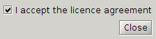
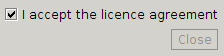
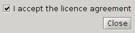

# Decaf Test Utilities

Some classes for performing integration tests on Java Swing applications the brute force way. [Bender](src/main/java/com/bensler/decaf/testutil/Bender.java) - a wrapper around `java.awt.Robot` - clicks through a Swing app and performs test by making screen shots and comparing them with given images.

When such an image compare fails two files are dropped into `target/surefire-reports`: an actual screen shot and an animated GIF made of three frames:
 1.  expected image
 2.  diff image (pixels being not as expected are red)
 3.  actual screenshot

If a test failure comes from an intended program change the actual screenshot might act as template image in future. It just need to be copied into the `src/test/resources` folder replacing the old one.

[EntityTreeTest](../decaf-swing/src/test/java/com/bensler/decaf/swing/tree/EntityTreeTest.java) in [decaf-swing](../decaf-swing) makes use of it.

## Build
Test code of this project depends on JGoodies libs which are not available in a public maven repo. You need to install them into your local repository as described in [decaf/README](../README.md) file.

## Sample
There is a sample test case [SimpleTest](src/test/java/com/bensler/decaf/testutil/SimpleTest.java) being a little dialog with an checkbox and a close button. The button gets enabled when the checkbox is checked and vice versa.

<table border=0>
  <tr>
    <td><strong>how it should look like</strong>  
    after clicking the checkbox (button enabled)</td>
    <td></td>
  </tr>
  <tr>
    <td><strong>how it actually looks like</strong>  
    button is not enabled, some code change introduced a bug</td>
    <td></td>
  </tr>
  <tr>
    <td><strong>diff-GIF</strong>  
    emphasizing the regions which are not as expected</td>
    <td></td>
  </tr>
</table>
 